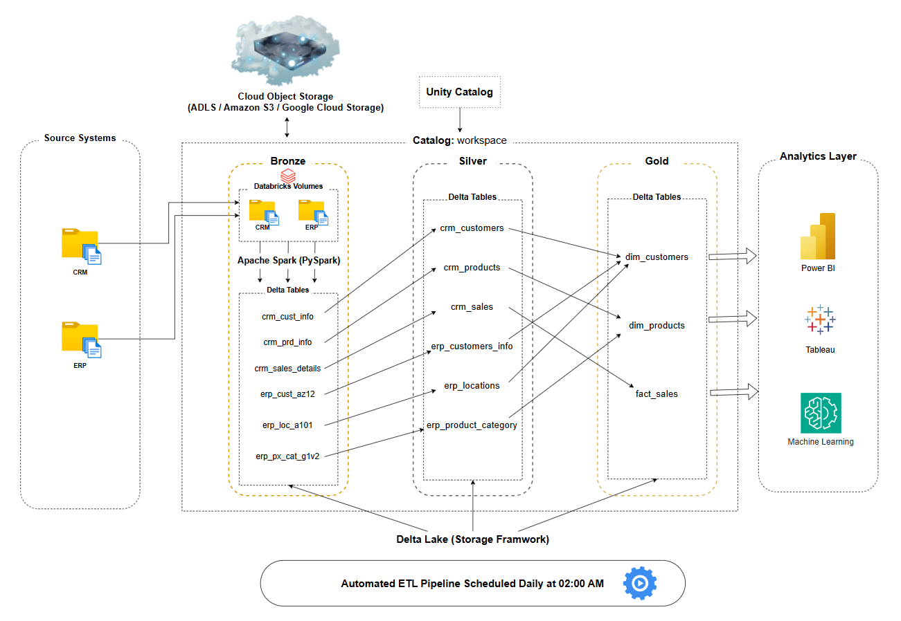

# 🏬 RetailLakehouse: End-to-End Databricks Lakehouse Architecture

An end-to-end Data Engineering project built on the **Databricks Lakehouse Platform** using the **Medallion Architecture (Bronze → Silver → Gold)**. The project ingests CRM and ERP data, transforms it using **Apache Spark (PySpark)**, stores it as **Delta Tables**, and delivers analytics-ready data through an automated ETL pipeline.

---

# 🏗️ Architecture

<p align="center">
  
</p>

---

# ⚙️ Technology Stack

| Category | Technology |
|----------|------------|
| Platform | Databricks |
| Processing | Apache Spark (PySpark) |
| Storage Framework | Delta Lake |
| Governance | Unity Catalog |
| Raw Data Storage | Databricks Volumes |
| Workflow Orchestration | Databricks Workflows |
| Architecture | Medallion Architecture |
| Language | Python (PySpark) |

---

# 🏛️ Medallion Architecture

### 🥉 Bronze
- Ingests raw CRM and ERP data from Databricks Volumes and stores it as raw Delta Tables.

### 🥈 Silver
- Cleanses, validates, standardizes, and transforms raw data into trusted, high-quality datasets for downstream analytics.

### 🥇 Gold
- Builds business-ready dimension and fact tables optimized for reporting, dashboards, and business intelligence.

---

# 🚀 Pipeline Automation

The ETL pipeline is fully automated using **Databricks Workflows**.

- **Schedule:** Daily at **02:00 AM (UTC+05:30)**
- **Execution Flow:** Bronze → Silver → Gold

---

# 🔐 Data Governance

The project leverages **Unity Catalog** for:

- Fine-grained access control
- Metadata management
- Data lineage
- Centralized governance

---

# ⭐ Key Features

- End-to-End Databricks Lakehouse implementation
- Medallion Architecture (Bronze → Silver → Gold)
- Apache Spark (PySpark) transformations
- Delta Lake with ACID-compliant storage
- Unity Catalog for governance
- Databricks Volumes for raw data ingestion
- Automated ETL using Databricks Workflows

---

# 📂 Repository Structure

```text
RetailLakehouse/
│
├── notebooks/
│   ├── bronze/
│   ├── silver/
│   └── gold/
│
├── datasets/
│   ├── source_crm/
│   └── source_erp/
│
├── docs/
│   └── lakehouse_architecture.png
│
├── LICENSE
└── README.md
```

---

# 📜 License

This project is licensed under the **MIT License**.

---

## 👨‍💻 Author

**Ravi Teja**
